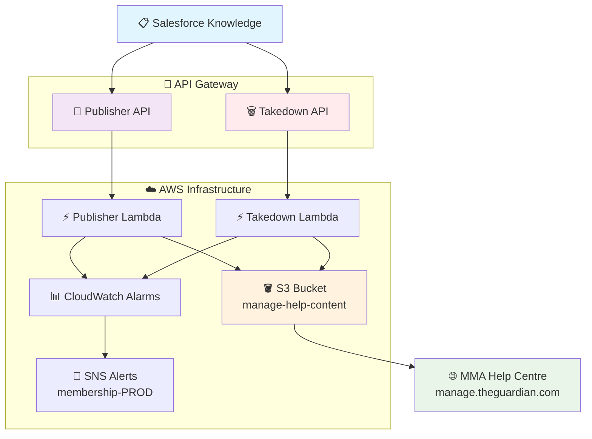
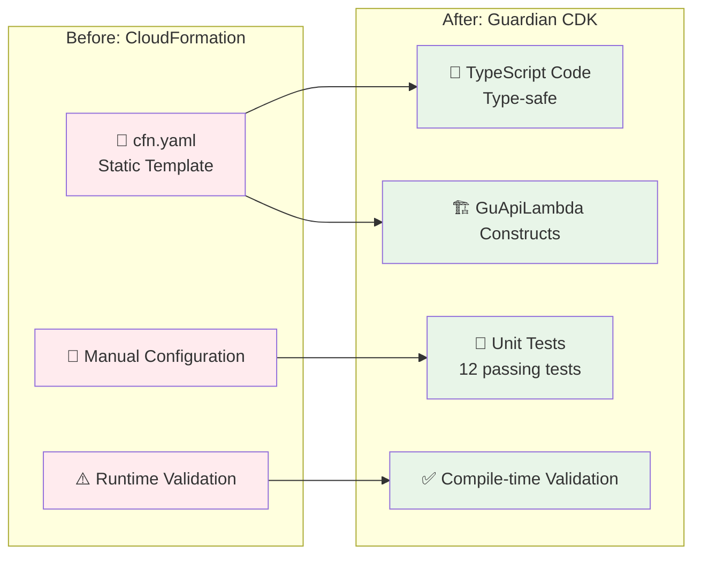
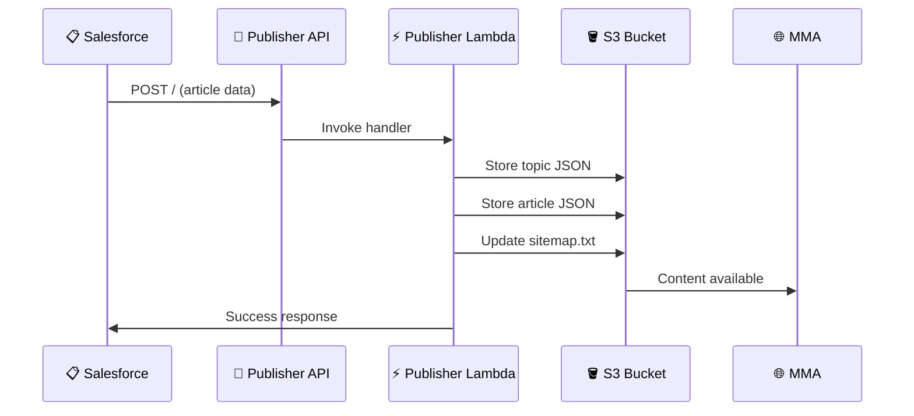
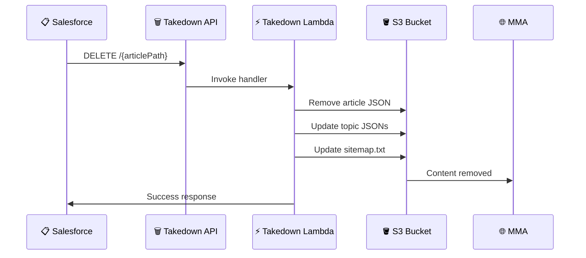
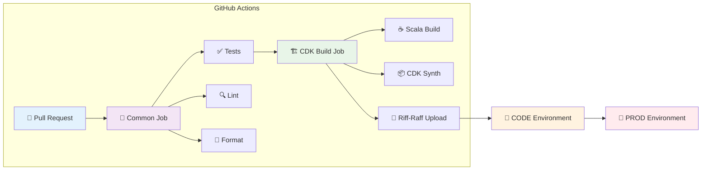

# 📚 Manage Help Content Publisher

> 🚀 **Modernized with AWS CDK** - Migrated from CloudFormation to Guardian CDK for enhanced maintainability and best practices

[](https://github.com/guardian/manage-help-content-publisher/actions)
[](https://github.com/guardian/cdk)
[](https://aws.amazon.com/lambda/)

## 🎯 Overview

This service publishes Help Centre content from [Salesforce Knowledge](https://gnmtouchpoint.lightning.force.com/lightning/o/Knowledge__kav/list?filterName=00B5I000003lI1KUAU) to [MMA (Manage My Account)](https://manage.theguardian.com/help-centre), providing Guardian readers with up-to-date support documentation.

## 🏗️ Architecture



## 🔄 Migration to CDK

This project has been **successfully migrated** from CloudFormation to **Guardian CDK**, bringing:

### ✨ Benefits of CDK Migration

| Feature | Before (CloudFormation) | After (Guardian CDK) |
|---------|------------------------|---------------------|
| 🏗️ **Infrastructure** | Static YAML templates | Type-safe TypeScript code |
| 🧪 **Testing** | Manual validation | 12 automated unit tests |
| 🔧 **Maintainability** | Complex YAML syntax | Readable, modular code |
| 📦 **Reusability** | Copy-paste patterns | Guardian CDK constructs |
| 🛡️ **Type Safety** | Runtime errors | Compile-time validation |
| 🚀 **Deployment** | Single API Gateway | Dual API Gateway architecture |

### 🎯 Architecture Evolution



## 🚀 API Endpoints

### 1. 📝 Publishing Articles

**Endpoint:** `POST /`  
**Purpose:** Publishes help content from Salesforce to S3



**Process:**
- 📄 JSON file for each topic with associated articles → `manage-help-content/topics/`
- 📄 JSON file for the input article → `manage-help-content/articles/`
- 🗺️ Updated `sitemap.txt` for SEO

### 2. 🗑️ Removing Articles

**Endpoint:** `DELETE /{articlePath}`  
**Purpose:** Removes help content from S3



## 🛠️ Development

### 📋 Prerequisites

- **Node.js** v22.17.0+ (managed via `.nvmrc`)
- **Java** 11+ (for Scala/Lambda compilation)
- **pnpm** (package manager)
- **AWS CLI** configured

### 🚀 Quick Start

```bash
# 1. Install Node.js version
nvm use

# 2. Enable pnpm
corepack enable

# 3. Install dependencies
pnpm install

# 4. Run all checks (lint, test, build)
pnpm package

# 5. Deploy to CODE environment
pnpm cdk deploy ManageHelpContentPublisher-CODE
```

### 🧪 Testing

```bash
# Run unit tests
pnpm test

# Run with coverage
pnpm test -- --coverage

# Type checking
pnpm type-check

# Linting
pnpm lint

# Format code
pnpm format
```

### 📊 Test Coverage

- ✅ **12/12 tests passing**
- 🧪 **Lambda function configuration**
- 🔗 **API Gateway setup**
- 🛡️ **IAM policies validation**
- ⏰ **CloudWatch alarms (PROD only)**
- 🏷️ **Guardian compliance checks**

## 🚀 Deployment

### 🔄 CI/CD Pipeline



### 🌍 Environments

| Environment | Purpose | Monitoring |
|-------------|---------|------------|
| **CODE** 🧪 | Development & Testing | Basic logging |
| **PROD** 🌟 | Production | Full CloudWatch alarms + SNS alerts |

### 📦 Riff-Raff Configuration

The deployment uses a **dual-deployment strategy**:

1. **🏗️ Infrastructure Deployment** (`manage-help-content-publisher-cloudformation`)
   - Deploys CDK-generated CloudFormation templates
   - Creates Lambda functions, API Gateways, IAM roles

2. **⚡ Lambda Deployment** (`manage-help-content-publisher`)
   - Uploads compiled JAR files
   - Updates Lambda function code

## 📁 Project Structure

```
manage-help-content-publisher/
├── 📂 .github/workflows/     # CI/CD pipelines
│   └── ci-cdk.yml           # Main deployment workflow
├── 📂 bin/                  # CDK app entry point
│   └── cdk.ts              # CDK application
├── 📂 lib/                  # CDK infrastructure code
│   ├── manage-help-content-publisher-stack.ts
│   └── manage-help-content-publisher-stack.test.ts
├── 📂 src/                  # Scala/Java source code
├── 📂 scripts/              # Utility scripts
├── 📂 legacy-content-import/ # Legacy import tools
├── 📄 riff-raff.yaml        # Deployment configuration
├── 📄 cdk.json             # CDK configuration
├── 📄 package.json         # Node.js dependencies
├── 📄 build.sbt            # Scala build configuration
└── 📄 .nvmrc               # Node.js version
```

## 🔧 Configuration

### 🌐 Environment Variables

| Variable | Description | Example |
|----------|-------------|---------|
| `App` | Application name | `manage-help-content-publisher` |
| `Stack` | Guardian stack | `membership` |
| `Stage` | Environment | `CODE` / `PROD` |

### 🪣 S3 Buckets

- **Content Bucket:** `manage-help-content` (configurable via CDK context)
- **Deployment Bucket:** `membership-dist` (configurable via CDK context)

### 🔐 IAM Permissions

The Lambda functions have permissions to:
- 📖 **Read** from deployment bucket
- 📝 **Read/Write/Delete** from content bucket
- 📋 **List** bucket contents

## 📊 Monitoring & Alerts

### 🚨 CloudWatch Alarms (PROD only)

| Alarm | Threshold | Action |
|-------|-----------|--------|
| **Publisher 4xx Errors** | ≥ 5 errors/min | SNS Alert |
| **Publisher 5xx Errors** | ≥ 5 errors/min | SNS Alert |
| **Takedown 4xx Errors** | ≥ 5 errors/min | SNS Alert |
| **Takedown 5xx Errors** | ≥ 5 errors/min | SNS Alert |

### 📈 Metrics Dashboard

Monitor your APIs through:
- 📊 **CloudWatch Dashboards**
- 🔍 **API Gateway metrics**
- ⚡ **Lambda function metrics**
- 🪣 **S3 access patterns**

## 🤝 Contributing

### 🔄 Development Workflow

1. **🌿 Create feature branch** from `main`
2. **💻 Make changes** with proper testing
3. **✅ Run checks:** `pnpm package`
4. **📝 Create Pull Request**
5. **🤖 CI/CD runs** automatically
6. **👥 Code review** by team
7. **🚀 Merge** triggers deployment

### 📝 Code Standards

- **TypeScript** for CDK infrastructure
- **Scala** for Lambda functions
- **ESLint + Prettier** for code formatting
- **Jest** for unit testing
- **Guardian CDK** patterns and constructs

## 🆘 Troubleshooting

### 🔍 Common Issues

| Issue | Solution |
|-------|----------|
| **CDK synthesis fails** | Run `pnpm type-check` to find TypeScript errors |
| **Tests failing** | Check `pnpm test` output for specific failures |
| **Deployment errors** | Check Riff-Raff logs and CloudWatch |
| **API errors** | Monitor CloudWatch alarms and Lambda logs |

### 📞 Support

- **📚 Documentation:** [RIFF-RAFF.md](./RIFF-RAFF.md)
- **🐛 Issues:** GitHub Issues
- **💬 Team Chat:** Guardian Slack channels
- **📖 Guardian CDK:** [CDK Documentation](https://github.com/guardian/cdk)

## 📚 Additional Resources

- **🏗️ [Guardian CDK](https://github.com/guardian/cdk)** - Infrastructure patterns
- **🚀 [Riff-Raff Documentation](./RIFF-RAFF.md)** - Deployment guide
- **☁️ [AWS CDK](https://docs.aws.amazon.com/cdk/)** - Official CDK docs
- **📋 [Salesforce Knowledge](https://gnmtouchpoint.lightning.force.com/)** - Content source
- **🌐 [MMA Help Centre](https://manage.theguardian.com/help-centre)** - Published content

---

<div align="center">

**🎉 Successfully migrated to Guardian CDK!**

*Built with ❤️ by the Guardian Membership team*

</div>
