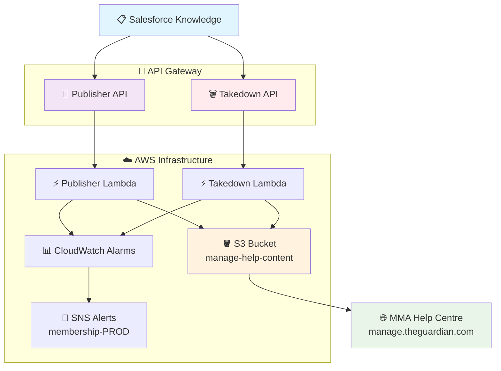
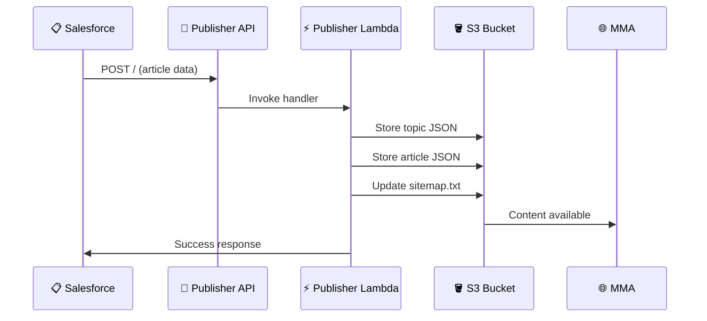
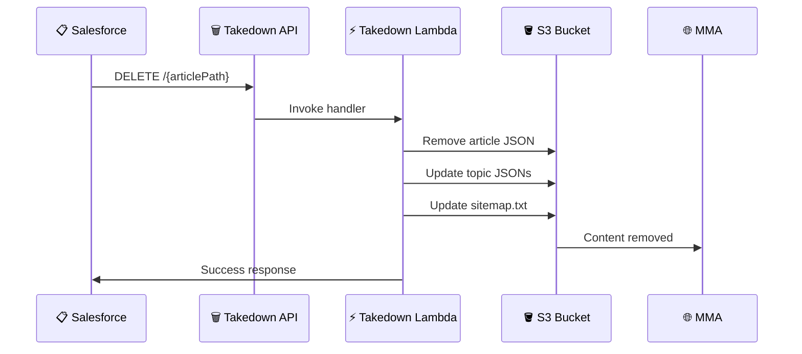

# 📚 Manage Help Content Publisher

> 🚀 **Modernized with AWS CDK** - Migrated from CloudFormation to Guardian CDK for enhanced maintainability and best
> practices

[](https://github.com/guardian/manage-help-content-publisher/actions)
[](https://github.com/guardian/cdk)
[](https://aws.amazon.com/lambda/)

## 🎯 Overview

This service publishes Help Centre content
from [Salesforce Knowledge](https://gnmtouchpoint.lightning.force.com/lightning/o/Knowledge__kav/list?filterName=00B5I000003lI1KUAU)
to [MMA (Manage My Account)](https://manage.theguardian.com/help-centre), providing Guardian readers with up-to-date
support documentation.

## 🏗️ Architecture



## 🚀 API Endpoints

### 1. 📝 Publishing Articles

**Endpoint:** `POST /`  
**Purpose:** Publishes help content from Salesforce to S3



**Process:**

- 📄 JSON file for each topic with associated articles → `manage-help-content/topics/`
- 📄 JSON file for the input article → `manage-help-content/articles/`
- 🗺️ Updated `sitemap.txt` for SEO

### 2. 🗑️ Removing Articles

**Endpoint:** `DELETE /{articlePath}`  
**Purpose:** Removes help content from S3



## 🛠️ Development

### 📋 Prerequisites

- **Node.js** v22.17.0+ (managed via `.nvmrc`)
- **Java** 11+ (for Scala/Lambda compilation)
- **pnpm** (package manager)
- **AWS CLI** configured

### 🚀 Quick Start

```bash
# 1. Install Node.js version
nvm use

# 2. Enable pnpm
corepack enable

# 3. Install dependencies
pnpm install

# 4. Run all checks (lint, test, build)
pnpm package
```

### 📊 Test Coverage

- ✅ **12/12 tests passing**
- 🧪 **Lambda function configuration**
- 🔗 **API Gateway setup**
- 🛡️ **IAM policies validation**
- ⏰ **CloudWatch alarms (PROD only)**
- 🏷️ **Guardian compliance checks**

## 🚀 Deployment

### 📦 Riff-Raff Configuration

The deployment uses a **dual-deployment strategy**:

1. **🏗️ Infrastructure Deployment** (`manage-help-content-publisher-cloudformation`)
    - Deploys CDK-generated CloudFormation templates
    - Creates Lambda functions, API Gateways, IAM roles

2. **⚡ Lambda Deployment** (`manage-help-content-publisher`)
    - Uploads compiled JAR files
    - Updates Lambda function code

## 🔧 Configuration

### 🌐 Environment Variables

| Variable | Description      | Example                         |
|----------|------------------|---------------------------------|
| `App`    | Application name | `manage-help-content-publisher` |
| `Stack`  | Guardian stack   | `membership`                    |
| `Stage`  | Environment      | `CODE` / `PROD`                 |

### 🪣 S3 Buckets

- **Content Bucket:** `manage-help-content` (configurable via CDK context)
- **Deployment Bucket:** `membership-dist` (configurable via CDK context)

### 🔐 IAM Permissions

The Lambda functions have permissions to:

- 📖 **Read** from deployment bucket
- 📝 **Read/Write/Delete** from content bucket
- 📋 **List** bucket contents

## 📊 Monitoring & Alerts

### 🚨 CloudWatch Alarms (PROD only)

| Alarm                    | Threshold      | Action    |
|--------------------------|----------------|-----------|
| **Publisher 4xx Errors** | ≥ 5 errors/min | SNS Alert |
| **Publisher 5xx Errors** | ≥ 5 errors/min | SNS Alert |
| **Takedown 4xx Errors**  | ≥ 5 errors/min | SNS Alert |
| **Takedown 5xx Errors**  | ≥ 5 errors/min | SNS Alert |

## 🤝 Contributing

### 🔄 Development Workflow

1. **🌿 Create feature branch** from `main`
2. **💻 Make changes** with proper testing
3. **✅ Run checks:** `pnpm package`
4. **📝 Create Pull Request**
5. **🤖 CI/CD runs** automatically
6. **👥 Code review** by team
7. **🚀 Merge** triggers deployment

### 📝 Code Standards

- **TypeScript** for CDK infrastructure
- **Scala** for Lambda functions
- **ESLint + Prettier** for code formatting
- **Jest** for unit testing
- **Guardian CDK** patterns and constructs

## 🆘 Troubleshooting

### 🔍 Common Issues

| Issue                   | Solution                                        |
|-------------------------|-------------------------------------------------|
| **CDK synthesis fails** | Run `pnpm type-check` to find TypeScript errors |
| **Tests failing**       | Check `pnpm test` output for specific failures  |
| **Deployment errors**   | Check Riff-Raff logs and CloudWatch             |
| **API errors**          | Monitor CloudWatch alarms and Lambda logs       |

---

<div align="center">

*Built with ❤️ by the Guardian Membership team*

</div>
